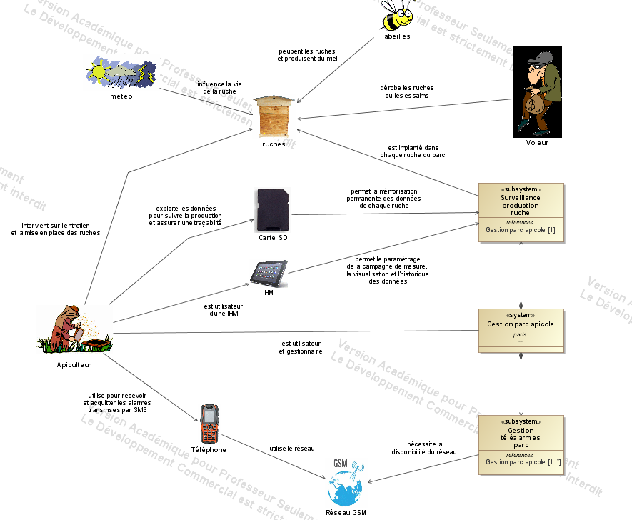
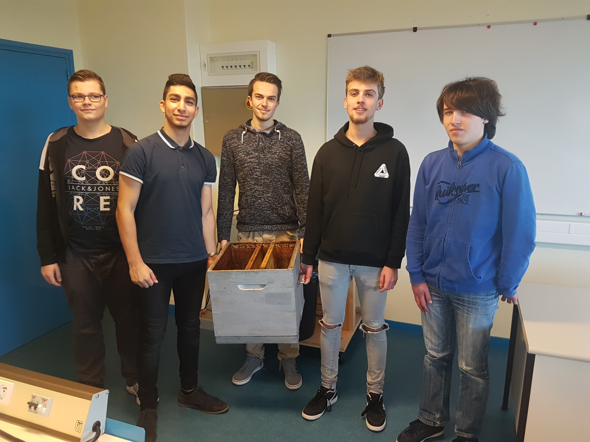
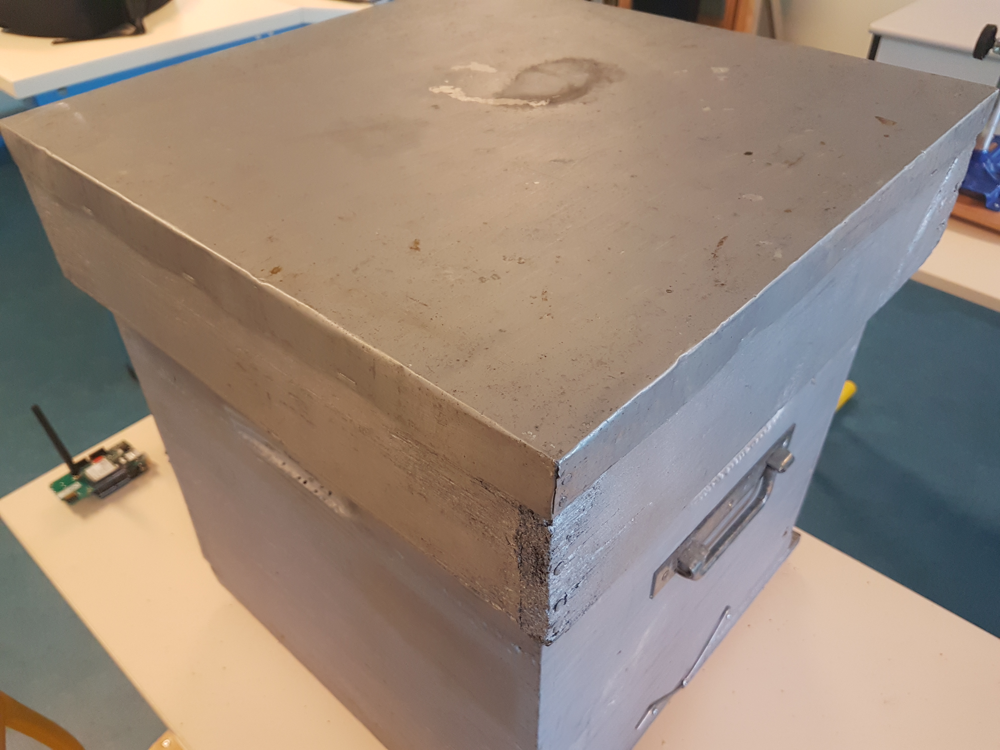
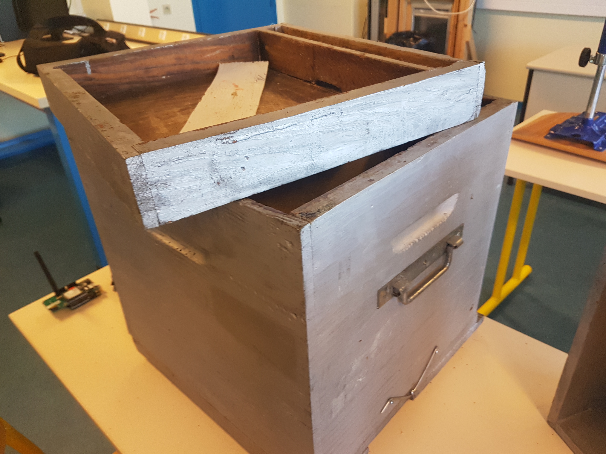
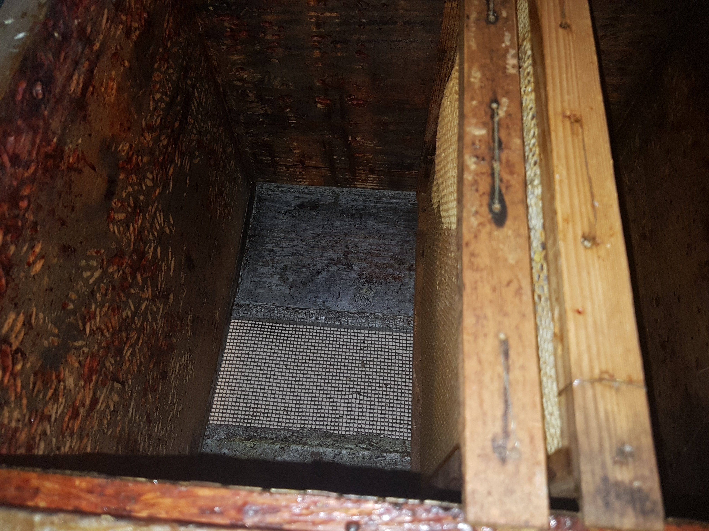
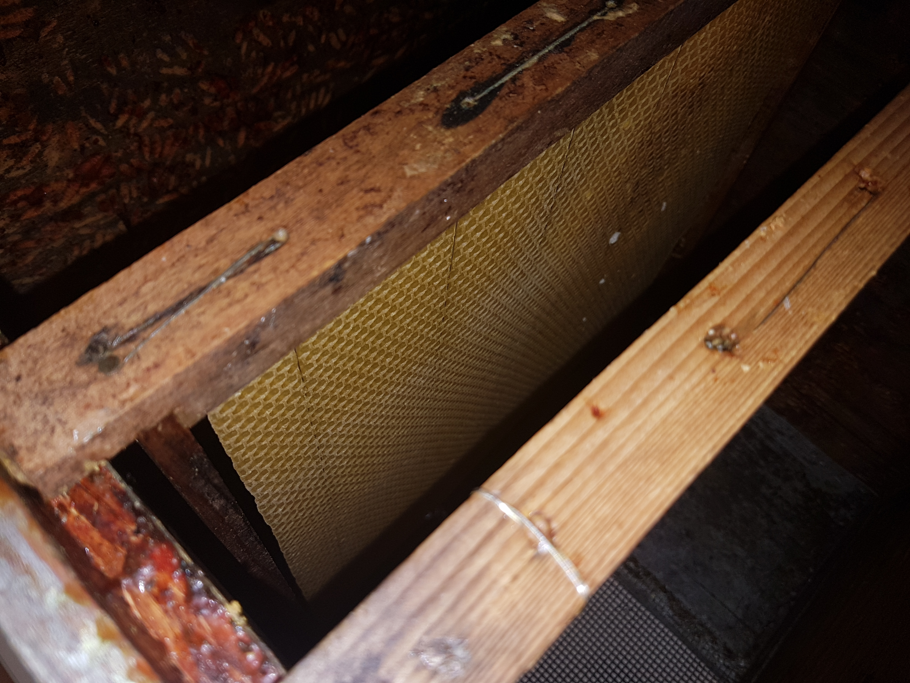
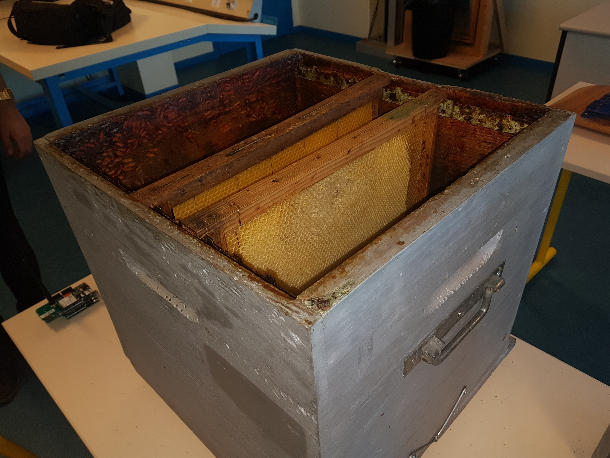

# ruchebac2017

#Matériels possibles

-capteur t°/humidité/masse 

-arduinos (nbrs à définir)  

-ANDROID IHM  

-Carte SD  

-Infrarouges/cable/sattelite/Bluetooth/Micro-Ondes  

-module GSM 

-panneaux solaire/éolienne   

#Qui fait quoi?

<b>Léo: </b>
Température/Hygrométrie 

<b>Botan: </b>
IHM/base de données en ligne 

<b>Titi: </b>
SMS/Alerte 

<b>Emilien: </b>
Mesure de masses  

<b>Maxime: </b>
Stockage données carte SD 

#Etapes
<b>Etape 1 </b> : 
Analyse du SysML &#9745; 

<b>Etape 2 </b> : 
Rencontrer apiculteur / definir contraintes &#9745;

<b>Etape 3 </b> : 
Se mettre d'accord sur les tâches à effectuer &#9744;

<b>Etape 4 </b> : 
Commencer partie personelle &#9744;

<b>Etape 5 </b> : 
Rassembler les programmes &#9744;

<b>Etape 6 </b> : 
Finalisation &#9744;

<b>Etape 7 </b> : 
Oral &#9744;

#Equipe

#Ruche (Type)

