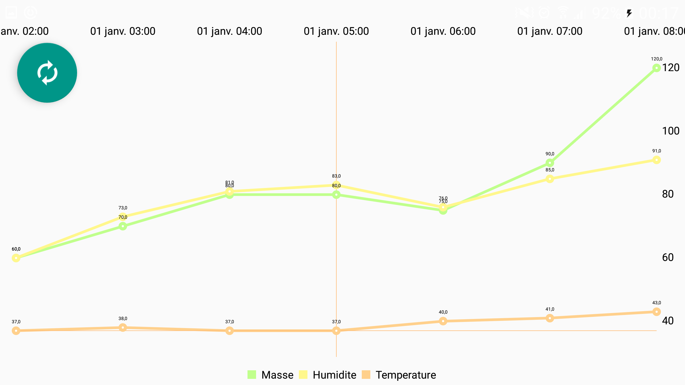

# ruchebac2017

#Objectif

Créer une IHM connectée au serveur Raspberry 

Communication entre le serveur arduino et l'IHM 

L'IHM devra permettre de selectionner une ruche et de voir sa masse/température & hygrometrie

#Screen

#liens  

http://www.framboise314.fr/airpi-la-3g-et-le-gps-pour-votre-raspberry-pi/ 
